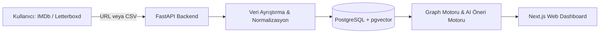

# 🎬 SuggestIT

> **IMDb ve Letterboxd verilerinizi anlamlandıran, sinema & dizi zevkinizin interaktif ağ haritasını çıkaran ve yapay zeka ile nokta atışı öneriler sunan yeni nesil öneri platformu.**

---

## 🌟 Öne Çıkan Özellikler

- 🔗 **Zahmetsiz Hesap Entegrasyonu:**
  - **IMDb:** Herkese açık profil URL'niz (Ratings & Watchlist) üzerinden tek tıkla otomatik senkronizasyon ve CSV içe aktarma desteği.
  - **Letterboxd:** Tek tıkla CSV yükleme ve RSS beslemesi üzerinden canlı aktivite takibi.
- 🕸️ **Taste Network Graph (Kişisel Zevk Ağ Haritası):**
  - İzlediğiniz ve yüksek puan verdiğiniz yapımlar, yönetmenler ve alt türlerin birbiriyle nasıl bağlandığını gösteren canlı, etkileşimli bir ağ grafiği (D3.js / Cytoscape).
- 🌉 **Film ⇄ Dizi Çapraz Köprüsü (Cross-Domain Bridge):**
  - Çok sevdiğiniz bir diziyi bitirip boşluğa düştüğünüzde aynı atmosfer, tempo ve tematik ağırlığı taşıyan filmler; ya da hayran kaldığınız bir filmin hissini uzatacak mini diziler.
- 🧠 **Semantik Vektör Eşleştirme & Negatif Filtreleme:**
  - Sadece yüzeysel tür etiketleri değil; hikayenin tonu, atmosferi ve tematik derinliği üzerinden vektörel benzerlik hesabı.
  - Düşük puan verdiğiniz yapımlardaki sevilmeyen ortak örüntüleri otomatik olarak ceza puanıyla eleyen akıllı filtre.
- 💬 **Şeffaf "Neden İzlemelisin?" Açıklamaları:**
  - Her önerinin altında geçmiş izleme alışkanlıklarınıza atıfta bulunan kişiselleştirilmiş açıklama kartları.

---

## 🏗️ Sistem Mimarisi



- **Backend:** Python (FastAPI), Pandas, BeautifulSoup4, Pydantic
- **Frontend:** Next.js (React, TypeScript), Tailwind CSS, D3.js
- **Veritabanı & Vektör Deposu:** PostgreSQL + pgvector
- **Harici Servisler:** TMDB API (Görsel ve künye), Gemini API (Embedding ve açıklama üretimi)

---

## 🚀 Hızlı Başlangıç (Local Setup)

### 1. Projeyi Klonlayın
```bash
git clone https://github.com/KULLANICI_ADINIZ/SuggestIT.git
cd SuggestIT
```

### 2. Backend Kurulumu & Çalıştırma
```bash
cd backend
python -m venv .venv

# Windows için
.venv\Scripts\activate

# Bağımlılıkları yükleyin
pip install -r requirements.txt

# Geliştirici sunucusunu başlatın
uvicorn app.main:app --reload --port 8000
```

Backend API ve Swagger dökümantasyonu: `http://localhost:8000/docs`

---

## 📁 Proje Yapısı

```
SuggestIT/
├── .gitignore
├── README.md
├── mimari.md           # Detaylı mimari dokümantasyonu
├── constant.md         # Değişmez tasarım ilkeleri
├── notlar.md           # Karşılıklı çalışma notları
├── backlog.md          # Görev ve ilerleme takibi
└── backend/
    ├── requirements.txt
    └── app/
        ├── main.py     # FastAPI uygulama çekirdeği
        ├── api/        # REST API endpoints
        ├── schemas/    # Pydantic veri modelleri
        └── services/   # IMDb ve CSV entegrasyon servisleri
```

---

## 📄 Lisans
Bu proje [MIT](LICENSE) lisansı altında geliştirilmektedir.
