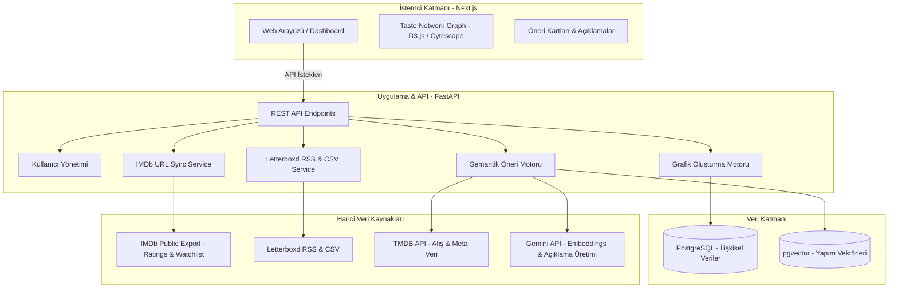

# SuggestIT - Sistem Mimari Dokümanı (Architecture Document)

## 1. Proje Özeti & Temel Değer Önerisi
**SuggestIT**, kullanıcıların IMDb ve Letterboxd verilerini (izleme geçmişi, puanlamalar, watchlist) analiz ederek:
- **Kişiselleştirilmiş Film & Dizi Önerileri:** Sadece tür benzerliğiyle değil, yapımların tematik ve duygusal DNA'sını eşleştiren semantik yapay zeka motoru.
- **Film ⇄ Dizi Çapraz Köprüsü (Cross-Domain):** Sevilen bir dizinin atmosferini taşıyan filmleri ya da bir filmin hissini uzatan mini dizileri keşfetme.
- **Kişisel Zevk Haritası (Taste Network Graph):** Kullanıcının izlediği yapımları, türleri, yönetmenleri ve temaları birbirine bağlayan interaktif bir görsel ağ grafiği.

---

## 2. Sistem Mimarisi & Teknoloji Yığını

Sistem iki ana katmandan oluşur: **Yapay Zeka / Veri Katmanı (Python FastAPI)** ve **Kullanıcı Arayüzü (Next.js)**.



### Teknoloji Seçimleri
- **Frontend:** `Next.js (App Router, React, TypeScript)` + `Tailwind CSS` + `D3.js` veya `Cytoscape.js` (Network Graph için).
- **Backend:** `Python (FastAPI)` – Asenkron veri çekme, veri analizi (Pandas) ve yapay zeka entegrasyonu için yüksek performanslı ve sade yapı.
- **Veritabanı:** `PostgreSQL` + `pgvector` (Kullanıcı profilleri, izleme geçmişi ve film/dizi anlamsal embedding vektörleri tek çatı altında).
- **Harici API'ler:**
  - **TMDB API:** Film/dizi afişleri, özetleri, oyuncu ve yönetmen künyeleri.
  - **Gemini API:** Semantik gömmeler (Embeddings) ve kullanıcıya özel "Neden izlemelisin?" açıklama metinleri.

---

## 3. Veri Entegrasyon Modeli

### 3.1 IMDb Entegrasyonu (URL Tabanlı Otomatik Çekim)
- Kullanıcı, IMDb profilindeki **Ratings** ve **Watchlist** herkese açık (Public) linklerini sisteme girer.
- Backend, IMDb'nin yerel `/export` uç noktasını kullanarak CSV tablosunu arka planda doğrudan çeker ve işler.
- Kullanıcı tek tıkla listelerini senkronize edebilir.

### 3.2 Letterboxd Entegrasyonu (Hibrit)
- **İlk Yükleme:** Kullanıcının hesap ayarlarından indirdiği tek zip/csv dosyasını arayüze yüklemesi (tüm geçmişin eksiksiz aktarımı).
- **Canlı Takip:** Kullanıcı adı tanımlandığında, Letterboxd RSS beslemesi (`/rss/`) dinlenerek son izlenen filmler otomatik sisteme düşer.

---

## 4. Çekirdek Özellikler & Fonksiyonel Tasarım

### 4.1 Kullanıcı Karakter Haritası (Taste Network Graph)
Tek bir **ağırlıklı, çok ilişkili graf** üzerine kurulu. Düğüm tipleri önceden sabitlenmiyor (Tür/Yönetmen/Yapım gibi 3 katman) — `title`, `genre`, `director`, `decade`, `keyword` aynı graf içinde birlikte var oluyor ve gerçek yapı, graf analizinden ortaya çıkıyor:

* **Kenar ağırlığı:** Yüksek puanlar üssel olarak daha ağır basar ve yakın zamanda izlenenler öne çıkarılır. (`weight = (puan/10)^2 × recency_factor`)
* **Bayesian shrinkage:** Bir özniteliğin (ör. bir tür) düğüm ağırlığı, kanıt sayısı arttıkça güvenilirlik kazanır.
* **Gerçek merkezilik (PageRank):** Düğüm boyutu ağırlıklı PageRank ile hesaplanır.
* **Topluluk tespiti (Louvain):** Graf, önceden tanımlanmış "tür kümeleri" değil, organik olarak oluşan **zevk toplulukları** buluyor.
* **Köprü (bridge) düğümler:** betweenness centrality ile, iki farklı zevk topluluğunu birbirine bağlayan düğümler tespit ediliyor.
* **Karakter Özeti (Persona):** Her pozitif-valence topluluk için deterministik ham gerçekler çıkarılıp LLM'e verilerek mizahi bir unvana çevrilir. Düşük puanlı kümeler "Kaçındığın Kalıp" olarak gösterilir.

### 4.2 Akıllı Öneri Motoru (Recommendation Engine)
1. **Çok merkezli zevk uzayı:** Eski tasarımdaki tek merkeze karşın, yeni tasarımda her Louvain topluluğu kendi puan-ağırlıklı centroid'ine sahip; bir aday, en yakın olduğu merkeze göre puanlanır.
2. **Graf yakınlık bonusu:** Aday, kullanıcının kimliğini tanımlayan yüksek-PageRank düğümlere (tür/yönetmen) bağlıysa ekstra puan alır.
3. **Çapraz eşleşme (Dizi ⇄ Film):** Medya türü farkını aşmak için, anlatı DNA'sı (tempo/ton etiketleri) alt vektörü üzerinden karşılaştırma yapılıp bonus ekleniyor.
4. **Yumuşak negatif filtreleme:** Sert eleme yerine, düşük puanlı yapımlara anlamsal benzerlik oranında ceza puanı düşülür.
5. **Keşif (novelty) bonusu:** İzlenenlerin hiçbirine aşırı yakın olmayan adaylar küçük bir bonus alır.
6. **MMR yeniden sıralama:** Son liste sadece skora göre değil, Maximal Marginal Relevance (MMR) ile çeşitlilik de gözetilerek sıralanır.
7. **"Neden İzlemelisin?" katmanı:** Gerekçe skorlama sürecinin ürettiği gerçek sinyallerden deterministik olarak çıkarılıyor ve LLM destekli cümleye dönüştürülüyor.

---

## 5. Veri Modeli (Database Schema Özeti)

```
[Users]
  - id (UUID, PK)
  - email, username, created_at

[ExternalConnections]
  - id (UUID, PK)
  - user_id (FK -> Users)
  - platform ('imdb' | 'letterboxd')
  - identifier_url (IMDb profile URL veya Letterboxd username)
  - last_synced_at

[Titles] (Filmler & Diziler)
  - id (UUID, PK)
  - tmdb_id, imdb_id
  - title, type ('movie' | 'tv_series')
  - release_year, duration_mins
  - genres (Array)
  - directors, cast (JSON)
  - overview (Text)
  - embedding (Vector - 768 / 1536 dim)

[UserInteractions]
  - id (UUID, PK)
  - user_id (FK -> Users)
  - title_id (FK -> Titles)
  - source ('imdb_rating', 'imdb_watchlist', 'letterboxd')
  - rating (Float, opsiyonel)
  - is_watched (Boolean)
  - is_watchlist (Boolean)
  - watched_at (Timestamp)
```

---

## 6. Geliştirme Aşamaları (Roadmap)

- **Faz 1: Çekirdek Veri Altyapısı & IMDb/Letterboxd Aktarıcı**
  - FastAPI projesinin kurulması.
  - IMDb URL'sinden Ratings ve Watchlist CSV çekme servisinin yazılması.
  - Letterboxd CSV / RSS parser servisinin yazılması.
  - TMDB API ile başlıkların eşleştirilmesi.

- **Faz 2: Taste Network Graph (Karakter Ağ Grafiği)**
  - Kullanıcı izleme geçmişinden Graph veri yapısının (nodes & edges) hesaplanması.
  - Next.js arayüzünde D3.js / Cytoscape ile etkileşimli görselleştirme.

- **Faz 3: AI Öneri Motoru & Çapraz Eşleşme**
  - pgvector ve Gemini Embedding entegrasyonu.
  - Film-dizi çapraz öneri algoritmasının kurgulanması.
  - Açıklama metinlerinin (LLM prompts) oluşturulması.

- **Faz 4: Web Arayüzü & Yayına Alma**
  - Kullanıcı onboarding akışı (URL girme, dosya yükleme).
  - Öneri kartları ve filtreler (Platform, Süre, Tür).
